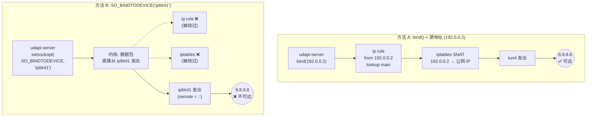
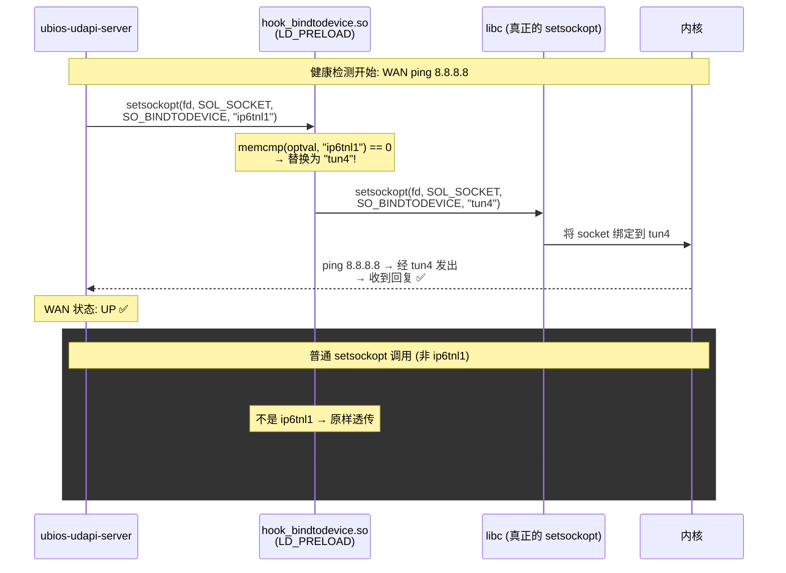
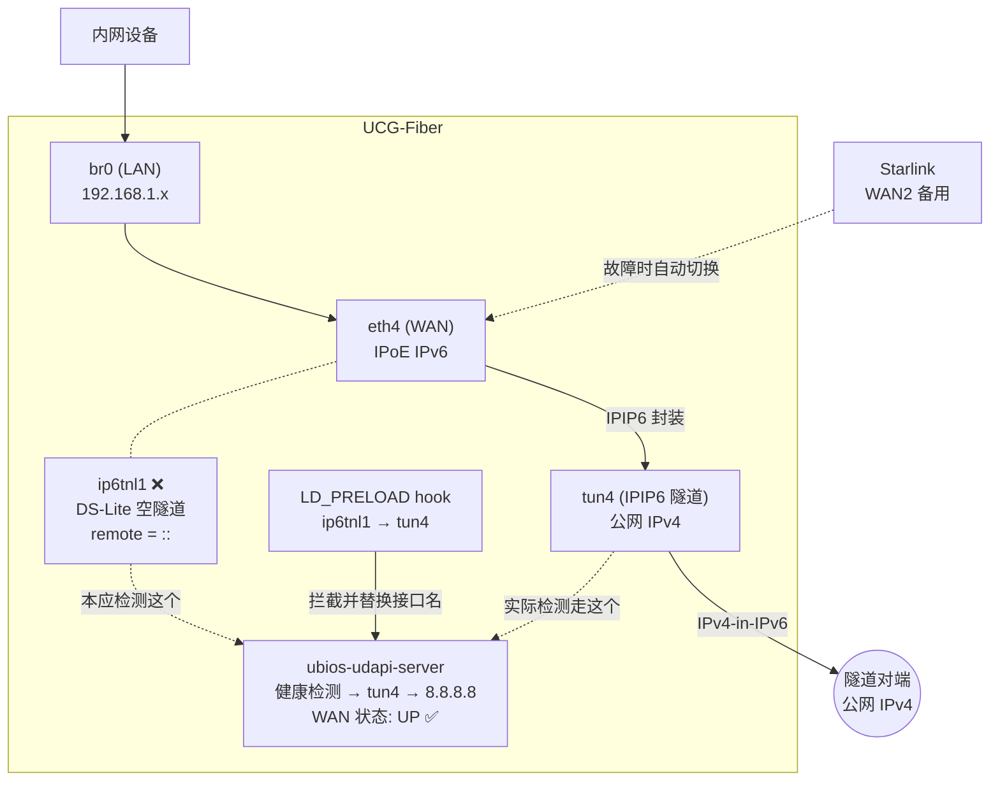

> SoftBank 10G 光纤 + UCG-Fiber + IPIP6 隧道 + 一个 15 行的 C shim = 完美的 WAN 状态
>
> *本文章和其背后的工作由我和 Claude Code 共同完成*

## 背景：10Gbps 光纤的烦恼

前年搬家后换上了 [SoftBank 光・10ギガ](https://www.softbank.jp/internet/sbhikari/10g/)。速度是真的快，但有个问题：**SoftBank 强制要求使用他们的路由器(XG-1000NE)**。这玩意负责 IPoE 认证和 SoftBank 自有的 IPv4 over IPv6 隧道，没有它的话，就只能通过 DHCPv6 拿到 IPv6 地址，拿不到 IPv4。

最近捡了一台UCG Fiber，它有一个完整的 Debian 系统，于是我就开始研究能不能用它来代替 SoftBank 的路由器。


问题是：UCG-Fiber 的 UniFiOS 原生不支持 SoftBank 的 IPv4 over IPv6 方案。它支持 v6plus (MAP-E) 和 OCN バーチャルコネクト，但 SoftBank 用的是自己的 IPIP6 隧道协议——完全不在支持列表上。

## 发现 luci-app-fleth

在 GitHub 上搜索的时候发现了 [luci-app-fleth](https://github.com/makeding/luci-app-fleth)，一个专为日本 ISP 设计的 OpenWrt 插件。它支持 DS-Lite、MAP-E 和**独立 IP（IPIP6）**三种模式，其中独立 IP 模式正是我需要的：通过 IPIP6 隧道获取一个专属的公网 IPv4 地址，并且作者也说在 SoftBank 10G 东日本测试通过了。

但这个项目是给 OpenWrt 的。UCG-Fiber 直接刷成 OpenWrt 并不方便。不过看了它的脚本 `ipip6h.sh`，其实就是几行命令：

```bash
ip tunnel add tun4 mode ipip6 local <本地IPv6> remote <对端IPv6> dev eth4
ip link set tun4 mtu 1460 up
ip addr add <公网IPv4>/32 dev tun4
ip route add default dev tun4
```

这些命令在 UCG-Fiber 上完全可以跑。于是我手动搭建了隧道，加上 iptables 做 NAT 和端口转发，试了一下真的能拿到v4地址。不过只要在路由器的UI上改一下设置就会把隧道破坏掉，于是写了个 watchdog 脚本每 15 秒检查一次隧道状态——**互联网访问完美恢复了**。

## 问题浮现：WAN 状态 DOWN

虽然隧道工作，但 UniFi 的管理界面里 WAN 状态一直显示为 **DOWN**。

虽然也能凑活用，但我家里还有 **Starlink** 网络，我想把它作为备用 WAN，利用 UCG-Fiber 的双 WAN 故障切换功能。但 UniFi 的 failover 逻辑依赖 WAN 健康状态——如果主 WAN 永远显示 DOWN，故障切换就没用。

### 为什么会 DOWN？

IPv4是tun拿到的，而WAN接口自己不持有任何IPv4

试过在 UniFi 里把 WAN 设置为 DS-Lite 模式，也只能拿到一个无用地址192.0.0.2。不过系统会自动创建一个名为 `ip6tnl1` 的隧道接口。这个隧道的远端是 `::`。UniFi 通过这个接口做健康检测，结果当然是一直失败。

```
ip6tnl1: <POINTOPOINT,NOARP,UP,LOWER_UP> mtu 1452
    link/tunnel6 2400:...:1 peer ::
    inet 192.0.0.2/29 scope global ip6tnl1   ← DS-Lite B4 地址
```

而我们真正工作的隧道 `tun4`，UniFi 完全不知道它的存在。

## 第一次尝试：劫持源地址路由（失败）

我的第一个想法是：既然 UniFi 通过 `ip6tnl1` 做健康检测（ping 8.8.8.8），那我让这些 ping 包走 `tun4` 出去不就行了？

```bash
# 让来自 DS-Lite B4 地址 (192.0.0.2) 的流量走主路由表
ip rule add from 192.0.0.2 lookup main prio 100
# 把源地址 SNAT 成隧道的公网 IP
iptables -t nat -A POSTROUTING -s 192.0.0.2 -o tun4 -j SNAT --to-source 126.206.229.60
```

测试：

```bash
$ ping -I 192.0.0.2 8.8.8.8     # 绑定源地址
PING 8.8.8.8: 64 bytes, time=5.8ms   ← 成功！

$ ping -I ip6tnl1 8.8.8.8        # 绑定接口
100% packet loss                       ← 失败
```

**绑定源地址有效，但绑定接口无效。** `SO_BINDTODEVICE` 直接在链路层把包从指定接口发出，完全绕过路由表和 ip rule。问题是：`ubios-udapi-server` 到底用的是哪种方式？

答案很快就明确了——管理页面的 WAN 状态依然是 DOWN。**它用的是 `SO_BINDTODEVICE`。**



## 其他失败的尝试

在找到最终方案之前，我还试了几条路：

**虚拟接口**：能不能创建一个 dummy/macvlan 接口骗过 UniFi UI？不行。UniFi 的端口列表是固件硬编码的，只显示 `eth0`-`eth6`，虚拟接口永远不会出现在 WAN 选择器里。

**修改路由表 201**：`ip6tnl1` 有自己的路由表（`201.ip6tnl1`），把它的默认路由指向 `tun4`？

```bash
ip route replace default dev tun4 table 201.ip6tnl1
```

然而 `SO_BINDTODEVICE` 连路由表都不看，包直接从 `ip6tnl1` 发出。

**修改二进制文件**：直接 patch `ubnt_monitor`？我用 `strings` 分析了它，发现大量 `Ping` 相关字符串……结果那都是 **Go HTTP/2 的 Ping frame**。这个进程实际上是 `analytic-report-go`，一个数据分析上报工具，根本不是健康检测器。

真正的健康检测器是 **`ubios-udapi-server`**，这是一个 30MB 的 C 程序。而它的接口名不是硬编码的，是运行时从 UDAPI 状态文件动态读取的，所以简单的字符串替换也行不通。

## 转机：它是动态链接的

当我快要放弃的时候，跑了一下 `ldd`：

```bash
$ ldd /usr/bin/ubios-udapi-server
    libudapi.so => /usr/lib/aarch64-linux-gnu/libudapi.so
    libsw.so => /usr/lib/libsw.so
    libc.so.6 => /lib/aarch64-linux-gnu/libc.so.6
    ...
```

**它是动态链接的！** 这意味着 `LD_PRELOAD` 可以用。



## 15 行代码的解决方案

既然 `ubios-udapi-server` 通过 `setsockopt(SO_BINDTODEVICE, "ip6tnl1")` 把健康检测绑定到那个坏掉的隧道上，我只需要在它调用 `setsockopt` 的时候把 `"ip6tnl1"` 偷偷换成 `"tun4"`：

```c
#define _GNU_SOURCE
#include <dlfcn.h>
#include <errno.h>
#include <string.h>
#include <sys/socket.h>

typedef int (*real_setsockopt_t)(int, int, int, const void *, socklen_t);

int setsockopt(int fd, int level, int optname,
               const void *optval, socklen_t optlen) {
    real_setsockopt_t real = dlsym(RTLD_NEXT, "setsockopt");
    if (!real) { errno = ENOSYS; return -1; }

    if (level == SOL_SOCKET && optname == SO_BINDTODEVICE &&
        optval && optlen >= 7 && memcmp(optval, "ip6tnl1", 7) == 0)
        return real(fd, level, optname, "tun4", 5);

    return real(fd, level, optname, optval, optlen);
}
```

逻辑非常简单：
1. 用 `dlsym(RTLD_NEXT, ...)` 获取真正的 `setsockopt`
2. 如果调用者想绑定到 `ip6tnl1`，就替换成 `tun4`
3. 其他所有调用原样透传

### 交叉编译

UCG-Fiber 是 aarch64 架构，系统没有自带编译器。于是我用 `zig` 在 macOS 上交叉编译：

```bash
zig cc -target aarch64-linux-gnu -shared -fPIC -o hook_bindtodevice.so hook_bindtodevice.c
```

### 部署

把编译好的 `.so` 上传到路由器，通过 systemd drop-in 注入到 `udapi-server`：

```ini
# /etc/systemd/system/udapi-server.service.d/wan-hook.conf
[Service]
Environment=LD_PRELOAD=/data/hook_bindtodevice.so
```

```bash
systemctl daemon-reload && systemctl restart udapi-server
```

### 验证

```bash
# 确认 hook 已加载到进程中
$ cat /proc/$(pgrep -of ubios-udapi-server)/environ | tr '\0' '\n' | grep PRELOAD
LD_PRELOAD=/data/hook_bindtodevice.so

$ cat /proc/$(pgrep -of ubios-udapi-server)/maps | grep hook
7f86c7c000-7f86d0f000 ... /data/hook_bindtodevice.so
```

然后看了一眼 UniFi Dashboard——**WAN 状态：UP** ✓


而且这个方案的优雅之处在于：当 `tun4` 真的挂掉时，通过 `tun4` 的健康检测也会失败，WAN 会正确显示为 DOWN，Starlink failover 也就能正常触发了。

## 完整架构

最终的系统架构：



**关键组件：**

- **tunnel-watchdog.sh**：每 15 秒运行，维护隧道状态、iptables 规则、健康检测。连续 3 次失败（45 秒）自动切换到 Starlink。
- **hook_bindtodevice.so**：15 行 C 的 LD_PRELOAD shim，让 UniFi 的健康检测走正确的接口。
- **tunnel.conf**：集中配置文件，端口转发只需改一行。

## 经验教训

### 1. `SO_BINDTODEVICE` 非常底层

普通的 `bind()` + 源地址路由可以通过 `ip rule` 和路由表来劫持，但 `SO_BINDTODEVICE` 直接在 socket 层绑定网络接口，**完全绕过路由决策**。这就是为什么 ip rule、路由表替换这些常规手段全部失效。

### 2. 先确认你在看正确的二进制

我花了不少时间分析 `ubnt_monitor`，结果它根本不是健康检测器。`strings` + `strace` 是你的好朋友，但更重要的是先搞清楚系统的整体架构。在 UniFi 的世界里，`ubios-udapi-server` 才是管理 WAN 状态的核心进程。

### 3. `zig cc` 交叉编译很方便

在 macOS ARM 上为 aarch64 Linux 编译 C 代码：

```bash
zig cc -target aarch64-linux-gnu -shared -fPIC -o output.so input.c
```

一行命令，不需要安装工具链，不需要 Docker。如果你经常需要为嵌入式 Linux 设备编译小工具，强烈推荐。

### 4. 配置文件化

最初我把所有 IP 地址硬编码在脚本里——watchdog 和 teardown 各一份。后来重构成共享配置文件 (`tunnel.conf`)，端口转发用数组定义：

```bash
PORT_FORWARDS=(
    "tcp:443:192.168.1.2:443" # Web
    "tcp:25565:192.168.1.3:25565" # Minecraft
)
```

加一条端口转发只需要多写一行，两个脚本自动适配。

## 项目地址

完整的配置文件和部署脚本：[GitHub 链接]()

包括一键部署 (`./deploy.sh ucg`)、一键停止 (`tunnel-teardown.sh`)、固件更新后自动恢复 (`on_boot.d`)。

---

*如果你也在日本用 SoftBank 10G + 非官方路由器，或者对 UniFi 设备的底层原理感兴趣，希望这篇文章对你有帮助。*
